# Dashboard Flowchart

## Feature: Dashboard (Executive Overview)
**Entry Point:** `Frontend_App/dashboard/src/views/DashboardView.jsx:957`

```mermaid
flowchart TD
    Start["User opens Dashboard<br/>DashboardView.jsx:957"]
    
    Start --> CheckDevice["Check Device Type<br/>DashboardView.jsx:960"]
    
    CheckDevice --> LoadCheck{"Loading?<br/>DashboardView.jsx:1038"}
    LoadCheck -->|Yes| ShowSkeleton["Render Skeleton<br/>DashboardView.jsx:1039-1050"]
    ShowSkeleton --> End1["Return Skeleton UI<br/>DashboardView.jsx:1049"]
    
    LoadCheck -->|No| IsMobile{"Is Mobile?<br/>DashboardView.jsx:1053"}
    
    IsMobile -->|Yes| MobileFlow["Render Mobile Dashboard<br/>DashboardView.jsx:1054-1063"]
    MobileFlow --> MobileGreeting["Display Greeting & Date<br/>DashboardView.jsx:765-771"]
    MobileGreeting --> MobileRings["Render Machine Story Rings<br/>DashboardView.jsx:774"]
    MobileRings --> MobileAlerts["Show Maintenance Alerts<br/>DashboardView.jsx:777-797"]
    MobileAlerts --> MobileKPI["Render KPI Grid 2x2<br/>DashboardView.jsx:800-805"]
    MobileKPI --> MobileActiveSessions["Display Active Sessions<br/>DashboardView.jsx:808-826"]
    MobileActiveSessions --> MobileProcore["Render Mobile Procore Card<br/>DashboardView.jsx:830"]
    MobileProcore --> MobileChart["Display Weekly Activity Chart<br/>DashboardView.jsx:833-858"]
    MobileChart --> EndMobile["Return Mobile Layout<br/>MobileDashboard.jsx:759-861"]
    
    IsMobile -->|No| DesktopFlow["Render Desktop Dashboard<br/>DashboardView.jsx:1067-1345"]
    DesktopFlow --> Header["Render Header & Filters<br/>DashboardView.jsx:1069-1076"]
    
    Header --> InitListeners["Initialize Firestore Listeners<br/>useStore.js:69-211"]
    InitListeners --> ListenSessions["Listen to Sessions Collection<br/>useStore.js:78-90"]
    ListenSessions --> ListenMachines["Listen to Machines Collection<br/>useStore.js:93-101"]
    ListenMachines --> ListenOperators["Listen to Operators Collection<br/>useStore.js:104-112"]
    ListenOperators --> ListenMaintenance["Listen to Maintenance Records<br/>useStore.js:115-123"]
    ListenMaintenance --> ListenObras["Listen to Obras Collection<br/>useStore.js:126-134"]
    ListenObras --> ListenLocCards["Listen to Location Cards<br/>useStore.js:137-145"]
    ListenLocCards --> ListenProcore["Listen to Procore Mirror Collections<br/>useStore.js:155-174"]
    ListenProcore --> ListenSettings["Listen to System Settings<br/>useStore.js:179-196"]
    ListenSettings --> ListenSchedules["Listen to Maintenance Schedules<br/>useStore.js:199-208"]
    
    ListenSchedules --> FilterSessions["Filter Sessions by Date<br/>useStore.js:521-557"]
    FilterSessions --> GetKPIs["Calculate KPIs<br/>useStore.js:599-688"]
    
    GetKPIs --> CalcHours["Sum Total Hours CLOSED Sessions<br/>useStore.js:604-606"]
    CalcHours --> CalcActive["Count Active Sessions OPEN<br/>useStore.js:609"]
    CalcActive --> CalcActiveMachines["Count ACTIVE Machines<br/>useStore.js:612-618"]
    CalcActiveMachines --> CalcUtilization["Calculate Utilization Rate<br/>useStore.js:620-626"]
    CalcUtilization --> CalcCO2["Calculate CO2 Emissions<br/>useStore.js:629-636"]
    CalcCO2 --> CalcFuel["Calculate Total Fuel<br/>useStore.js:639-645"]
    CalcFuel --> CalcMaintAlerts["Count Maintenance Alerts<br/>useStore.js:649-652"]
    CalcMaintAlerts --> CalcMTBF["Calculate MTBF<br/>useStore.js:654-662"]
    CalcMTBF --> CalcDowntime["Calculate Downtime %<br/>useStore.js:669-671"]
    
    CalcDowntime --> RenderKPIs["Render Primary KPI Cards<br/>DashboardView.jsx:1079-1119"]
    RenderKPIs --> RenderMaintAlert["Render Maintenance Alert Banner<br/>DashboardView.jsx:1122-1161"]
    RenderMaintAlert --> RenderWorkFocus["Render Work Focus Panel<br/>DashboardView.jsx:1163-1164"]
    
    RenderWorkFocus --> GetSmartMaint["Get Smart Maintenance Predictions<br/>useStore.js:256-304"]
    GetSmartMaint --> CalcRemaining["Calculate Remaining Hours<br/>useStore.js:258-260"]
    CalcRemaining --> GetRecent14Days["Get Recent 14-day Sessions<br/>useStore.js:270-279"]
    GetRecent14Days --> CalcAvgHours["Calculate Avg Hours/Day<br/>useStore.js:281-289"]
    CalcAvgHours --> PredictDate["Predict Maintenance Date<br/>useStore.js:291-298"]
    PredictDate --> ReturnPrediction["Return Prediction Object<br/>useStore.js:303"]
    
    ReturnPrediction --> RenderSecondaryKPIs["Render Secondary KPI Cards<br/>DashboardView.jsx:1167-1194"]
    RenderSecondaryKPIs --> UpdateUI["Dashboard Fully Loaded<br/>DashboardView.jsx:1345"]
    
    UpdateUI --> ListenRealTime["Real-time Firestore Updates<br/>useStore.js:83-89"]
    ListenRealTime --> SessionAdded["Session Added/Updated<br/>useStore.js:85-86"]
    SessionAdded --> RecomputeKPIs["Automatically Recompute KPIs<br/>useStore.js:599"]
    RecomputeKPIs --> RefreshUI["Update Dashboard UI<br/>DashboardView.jsx:1079"]
    
    style Start fill:#4f46e5,color:#fff
    style UpdateUI fill:#059669,color:#fff
    style GetKPIs fill:#0891b2,color:#fff
```

**External Dependencies:**
- `useStore` (getKPIs, getFilteredSessions, getSmartMaintenancePrediction)
- `useAlertsStore` (alert checks)
- `useDeviceType` (responsive layout detection)
- Procore API (`/api/procore/status`, `/api/procore/sync`)
- Firestore real-time subscriptions

**Key Constraints:**
- Real-time KPI recalculation on session changes
- Maintenance predictions use 14-day rolling average
- Mobile/Desktop responsive layouts
- Procore sync rate capped at 1/hour
